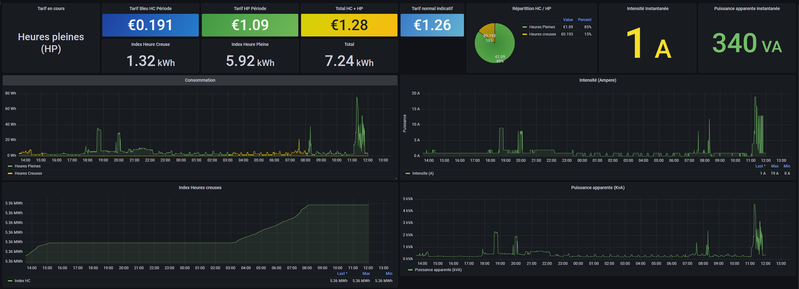

- [Linky monitoring on Raspberry Pi](#linky-monitoring-on-raspberry-pi)
  - [Physical installation](#physical-installation)
  - [Software installation](#software-installation)
    - [Pre requisites](#pre-requisites)
    - [Influxdb](#influxdb)
    - [Python script](#python-script)
    - [Grafana](#grafana)
    - [Optional: configure data retention policy](#optional-configure-data-retention-policy)
  - [License](#license)

# Linky monitoring on Raspberry Pi

This repository aims at providing a power consumption monitoring of a Linky electricity meter.

## Physical installation

The used Dongle is named "micro-teleinfo-v20" and available [here](https://www.tindie.com/products/hallard/micro-teleinfo-v20/).

- Connect Micro Teleinfo V2 dongle to the L1 & L2 connector of the Linky (the order as no influence)
- Connect Micro Teleinfo V2 dongle to the raspberry PI with USB

## Software installation

### Pre requisites

Following steps are not part of the doc and need to be done as pre requisites:

- Configure the network one the raspberry
- Configure the data
- Configure the timezone

Install picocom
```
apt install picocom
```

Check that the serial connection to the Linky is well captured by the dongle:
```
picocom -b 1200 -d 7 -p e -f n /dev/ttyUSB0
```

You should see this kind of output:
```
picocom v3.1

port is        : /dev/ttyUSB0
flowcontrol    : none
baudrate is    : 1200
parity is      : even
databits are   : 7
stopbits are   : 1
escape is      : C-a
local echo is  : no
noinit is      : no
noreset is     : no
hangup is      : no
nolock is      : no
send_cmd is    : sz -vv
receive_cmd is : rz -vv -E
imap is        :
omap is        :
emap is        : crcrlf,delbs,
logfile is     : none
initstring     : none
exit_after is  : not set
exit is        : no

Type [C-a] [C-h] to see available commands
Terminal ready
4 &
HCHP 000300819 (
PTEC HP..
IINST 002 Y
IMAX 090 H
PAPP 00500 &
HHPHC A ,
MOTDETAT 000000 B
ADCO XXXXXXXXXX A
OPTARIF HC.. <
ISOUSC 45 ?
HCHC 005337374 &
HCHP 000300820
PTEC HP..
IINST 002 Y
IMAX 090 H
PAPP 00500 &
HHPHC A ,
```

All fields are explained in the [official Enedis doc](https://www.enedis.fr/media/2035/download).


### Influxdb

INfluxdb is a time serie database. The tool will be in charge of saving the data retrieved by the Python script from the Dongle.

Install GPG key and the official package repository
```
wget -q -O - https://repos.influxdata.com/influxdb.key | gpg --dearmor | tee /usr/share/keyrings/influxdb-archive-keyring.gpg
echo "deb [signed-by=/usr/share/keyrings/influxdb-archive-keyring.gpg] https://repos.influxdata.com/debian $(lsb_release -cs) stable" > /etc/apt/sources.list.d/influxdb.list
```

Install
```
apt update && apt install influxdb
```

Enable and start the service
```
systemctl enable influxdb
systemctl start influxdb
```

### Python script

The python script will read the information from the serial connection and insert in the influxdb database every metrics in time.

Install required libraries
```
apt install python3-pip
pip3 install pySerial influxdb
```

Clone the project in `/home/pi`
```
git clone git@github.com:Sispheor/teleinfo-linky-with-raspberry.git
```

Go into the folder and execute the script
```
cd teleinfo-linky-with-raspberry
python3 teleinfo.py
```

Let the script run for a couple minutes then press `ctrl-c` to stop it.

Then, check if the database has been updated. Run the `influx client`
```
influx
```

In the new prompt, connect the the database and print series
```
USE teleinfo
SHOW SERIES;
```

Output example:
```
influx
Connected to http://localhost:8086 version 1.8.10
InfluxDB shell version: 1.8.10
> USE teleinfo
Using database teleinfo
> SHOW SERIES;
key
---
HCHC,host=raspberry,region=linky
HCHP,host=raspberry,region=linky
HHPHC,host=raspberry,region=linky
IINST,host=raspberry,region=linky
IMAX,host=raspberry,region=linky
ISOUSC,host=raspberry,region=linky
MOTDETAT,host=raspberry,region=linky
OPTARIF,host=raspberry,region=linky
PAPP,host=raspberry,region=linky
PTEC,host=raspberry,region=linky
>
```

To install the script as a service that will be executing on each boot of the raspberry pi, create a service file in `/etc/systemd/system/teleinfo.service` with the following content:

```
[Unit]
Description = Run teleinfo python script
After = network.target

[Service]
Type = simple
ExecStart = python /home/pi/teleinfo-linky-with-raspberry/teleinfo.py
User = pi
Group = pi
Restart = on-failure
SyslogIdentifier = teleinfo
RestartSec = 5
TimeoutStartSec = infinity

[Install]
WantedBy = multi-user.target
```

Enable the service
```
systemctl daemon-reload
systemctl enable teleinfo.service
systemctl start teleinfo.service
```

### Grafana

Grafana is an analytics & monitoring solution for databases. It will be in charge of showing graph and interpretation of the retrieved data.

Install GPG key and the official package repository
```
wget -q -O - https://packages.grafana.com/gpg.key | gpg --dearmor | tee /usr/share/keyrings/grafana-archive-keyring.gpg
echo "deb [signed-by=/usr/share/keyrings/grafana-archive-keyring.gpg] https://packages.grafana.com/oss/deb stable main" > /etc/apt/sources.list.d/grafana.list
```

Install
```
apt update && apt install grafana
```

Start the Grafana server
```
systemctl enable grafana-server
systemctl start grafana-server
```

Connect to Grafana dashboard on the port 3000 of your Rpi. E.g: http://IP_RASPBERRY:3000.

- Go into Configuration -> Datasources
- Add an InfluxDB datasource with:
  - **URL**: http://localhost:8086
  - **Database**: teleinfo

Then import the grafana dashboard from the repo (grafana_dashboard_teleinfo.json):

- From the left menu  selet import
- Browse files
- Select the `grafana_dashboard_teleinfo.json` file


>**Note:** To change the KiloWatt per hour price, edit Dashboard variables from the top right corner.

### Optional: configure data retention policy

The script will add a certain amount of data into the disk of the RPI everyday. To prevent a storage issue, you can create a retention policy on the database to automatically purge old data.

Run the influx client with `influx`. Then create a retention policy:
```
CREATE RETENTION POLICY "3_month" ON teleinfo DURATION 12w REPLICATION 1
```

For more info, refer to the [influxdb doc](https://docs.influxdata.com/influxdb/v1.8/query_language/manage-database/#create-retention-policies-with-create-retention-policy).

## License

Original script by https://github.com/SebastienReuiller/teleinfo-linky-with-raspberry
Licensed under Apache License 2.0
